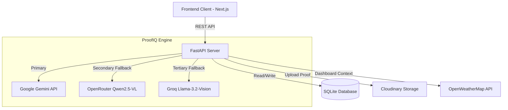
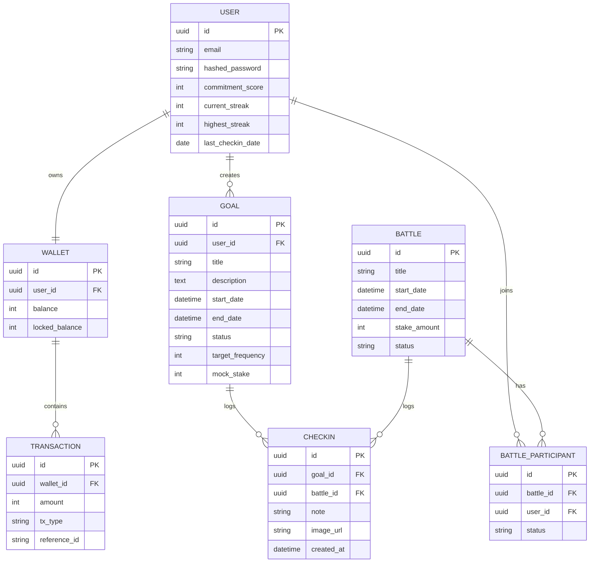

# StakeUp

StakeUp is an AI-powered accountability platform designed to force consistency through objective verification, gamification, and high-stakes challenges.

## The Problem

Many individuals struggle to maintain consistency when building new habits or pursuing goals. Traditional habit trackers rely entirely on self-reporting, which often leads to dishonesty, loss of motivation, and ultimately abandoning the goal. There is no tangible accountability, no social stakes, and no objective verification to ensure the user actually completed their task.

## The Solution

StakeUp solves this by removing self-reporting entirely. Instead of simply clicking a checkbox, users must upload photographic proof of their completed task. Our proprietary ProofIQ Vision Engine uses a multi-tiered AI pipeline to visually analyze the image and verify it against the goal's specific requirements. If the AI detects cheating, irrelevance, or placeholder images, the check-in is strictly rejected. 

To further enforce consistency, users can lock virtual currency (Stakeup Coins) into escrow for their challenges or participate in live 1v1 battles where the winner takes the entire pot. This creates an engaging, high-stakes ecosystem where users are financially and socially incentivized to succeed.

## Architecture Diagram

## Entity Relationship Diagram

## Technology Stack

### Frontend
- Framework: Next.js (App Router, React 19)
- Language: TypeScript
- Styling: Tailwind CSS v4
- State Management: Zustand
- Animations: Framer Motion

### Backend
- Framework: FastAPI (Python)
- Database ORM: SQLAlchemy
- Migrations: Alembic
- Database: SQLite (currently local for the hackathon). PostgreSQL is recommended for production deployment because SQLite is not suitable for concurrent production workloads.
- Authentication: JWT, Passlib, Bcrypt

### APIs & Integrations
- Google Gemini API (gemini-2.5-flash)
- OpenRouter API (Qwen2.5-VL-72b)
- Groq API (Llama-3.2-90b-Vision)
- Cloudinary API
- OpenWeatherMap API
